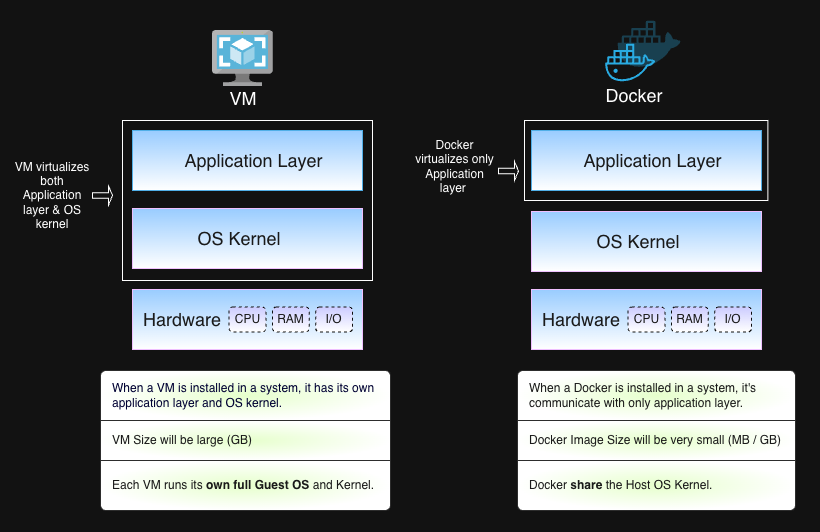

# Docker-ML-Pipeline

## Docker  
Docker is an open platform for Developing, Shipping & Running Application.
Docker enable you to seperate your applications from your infrastructure so you can deliver software quickly.

Docker methodologies for shipping, testing & deploying code quickly, so you can significantly reduce the delay between a writing code and running it in production enviroments.

## Docker Container: 
A way to package a application with all necessaru library, dependencies and configuration. It is a protable artifact property which can be easily share & move package to any enviroments. It makes developement and deployment more easy and efficient.

A Docker Container is a running instance of a Docker Image. When you execute the docker run command on an image, you create a container with all dependency. 

## Docker Image:
A Docker image is a lightweight, standalone, and executable package that contains everything needed to run a piece of software, including the code, runtime, system tools, system libraries, and settings.


## For Example: **🏠 The Household Shipping Analogy**


The image illustrates two methods for moving house items from Source House A to Destination House B:

### 1. Inefficient Method (Time-Consuming):

Shipping household items one by one (e.g., a lamp and a sofa separately) is depicted as a time-consuming process. This requires separate logistical steps for each item, increasing the duration and complexity of the move.

### 2. Efficient Method (Efficient & Rapid Process):

The items are first consolidated through Packing into a single, comprehensive transport unit (the Truck). This consolidation enables an Efficient & Rapid Process for transferring the entire collection to the destination.

Upon arrival at Destination House B, the contents are simply Unpacked for immediate use. Below is the same example that is consistent with this.


## 📦 Sharing Your AI Chatbot App with Docker
Imagine you've built an AI Chatbot on your Windows 10 computer. This chatbot needs many specific ingredients (dependencies and configurations) to run correctly—like a special version of Python, certain code libraries, and specific settings.

## The Problem Without Docker
If you just send your team member the code, they will have to spend hours trying to manually install all those special ingredients on their computer (which might be a Mac or Linux). They'll likely run into frustrating errors like "My code works on my machine, but not yours!"

### The Solution With Docker (The Ready-to-Use Kit)
You take your Chatbot's code and all those necessary ingredients (dependencies, configuration) and pack them up together into a single, standardized package called a Docker Image.

- You send this complete, sealed package (Docker Image) to Docker Hub (which is like a public warehouse or cloud storage).

- Unpacking and Using (Running the Docker Container):

- Your team member simply pulls the entire package from Docker Hub.

- With one command, they unpack and run that package on their computer.

**The result:** The Chatbot instantly runs perfectly, exactly as it did on your Windows machine, because the Docker Container provides the identical environment it was built in, regardless of their Mac or Linux system.

## What is Difference between Docker and VMS?

The main difference between a Docker and a Virtual Machine (VM), in the context of the operating system (OS), is the level of virtualization.

### What is Operating System?
An Operating System (OS) is system software that manages computer hardware and software resources and provides common services for computer programs.

### 🖥️ Virtual Machines (VMs)
A virtual machine is a software program that perfectly mimics a physical computer.

**Think of it like:** Building separate, full apartments on one piece of land.\
**The Problem:** VMs are heavy and slow to start.\
**The Setup:** Every single VM has its own complete Operating System (Guest OS), including its own separate kernel.\
**The Technology:** A layer called the Hypervisor manages the hardware and gives a slice of it to each VM, making it think it's a real, dedicated computer.\
**The Result:** You can run many different types of operating systems (like Ubuntu, CentOS, and Windows Server) on the same machine. This gives strong isolation but uses a lot of resources (RAM and disk space).

### 🐳 Docker Containers
**Think of it like:** Putting lightweight mobile homes on one shared foundation.\
**The Solution:** Containers are lightweight and fast to start.\
**The Setup:** All containers share the single Host OS Kernel from the underlying server. They do not need to boot up a separate, full OS.\
**The Technology:** The Docker Engine handles the OS Virtualization, isolating each container but letting them all use the shared resources efficiently.\
**The Result:** You only package the app and its necessary components (Bin/Libs, Runtime). This saves huge amounts of space and memory, making deployment fast and efficient.

### Docker VS VMs



## Docker Compose
Docker Compose is a tool for defining & running multi-container Docker applications. \
Instead of running each container individually using complex docker run commands, you define the entire application stack—all its services, networks, and volumes—in a single configuration file, typically named docker-compose.yml.

### 🏗️ Core Concepts of Docker Compose
    To save a Docker Compose, use docker-compose.yml

### 🎯 Why Use Docker Compose?
Simplifies Development: You can spin up a complex, multi-service environment (like a web app connected to a database and a message queue) with one command.\
Consistency: It ensures that every team member, and every environment (dev, staging), runs the exact same setup.\
Service Communication: It automatically creates a network for your services, allowing them to communicate using their service names without manual IP configuration.

### Process to use Docker

### Prerequisites
    Docker must be installed and running on your system.

### Process
1. Open a docker web app at your system
    
2. Create a Dockerfile(At your app location) and add all the necessary commands to run you applications as follow. 
```
    FROM python:3.8
    COPY . /app
    WORKDIR /app
    RUN pip install -r requirements.txt
    CMD python docker_app.py
```
3. Create or build a Docker Image
```
    docker build -t DockerImage .
```

4. Check a Docker Image is created or not
```
    docker images
```

5. Run a docker image 
```
    docker run -p 5050:5050 welcome-app
```
    -p:  is Port Mapping flag.
    -Left 5050: Host Machine port
    -Right 5050: Container port

6. How to Access the App\
Once you run above command, you would typically access the application by navigating to the following address in your web browser:

http://localhost:5050 (or the IP address of the host machine followed by :5050).

7. Stop a Docker image;
```
    docker stop
```